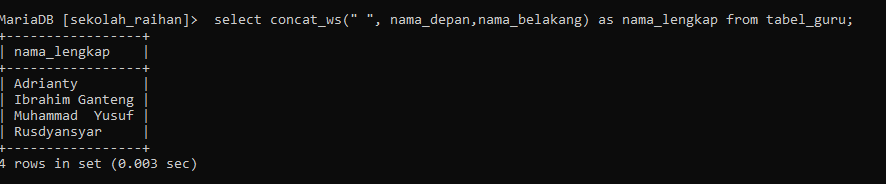

# Pertama
## Kode Program
```mysql
Create table tabel_guru(
id_guru int(16) primary key,
nama_depan varchar(26) not null,
nama_belakang varchar(26),
mapel varchar(50) not null,
jabatan varchar(26) not null,
usia int(3) not null,
tanggal_lahir varchar(26) null
)
```
## Hasil

## Analisis
- CREATE TABLE tabel_guru (  = Baris ini memulai pembuatan tabel baru dengan nama `tabel_guru`.
- id_guru int(16) primary key, =`id_guru` adalah kolom dengan tipe data integer yang panjangnya hingga 16 digit.
  Didefinisikan sebagai primary key, yang berarti nilai-nilainya harus unik dan tidak boleh NULL.
- nama_depan varchar(26) not null, = `nama_depan` adalah kolom dengan tipe data karakter bervariasi (varchar) dengan panjang maksimum 26 karakter.
  Didefinisikan sebagai `NOT NULL`, yang berarti kolom ini wajib diisi.
- nama_belakang varchar(26), = `nama_belakang` adalah kolom dengan tipe data karakter bervariasi (varchar) dengan panjang maksimum 26 karakter.
  Kolom ini boleh kosong (NULL), sehingga pengisian kolom ini opsional.
- mapel varchar(50) not null, = `mapel` adalah kolom dengan tipe data karakter bervariasi (varchar) dengan panjang maksimum 50 karakter.
  Didefinisikan sebagai `NOT NULL`, yang berarti kolom ini wajib diisi.
- jabatan varchar(26) not null, = `jabatan` adalah kolom dengan tipe data karakter bervariasi (varchar) dengan panjang maksimum 26 karakter. 
  Juga didefinisikan sebagai `NOT NULL`, yang berarti kolom ini wajib diisi.
- usia int(3) not null, = `usia` adalah kolom dengan tipe data integer yang panjangnya hingga 3 digit.
  Didefinisikan sebagai `NOT NULL`, yang berarti kolom ini wajib diisi.
- tanggal_lahir varchar(26) null = `tanggal_lahir` adalah kolom dengan tipe data karakter bervariasi (varchar) dengan panjang maksimum 26 karakter.
  Kolom ini boleh kosong (NULL), sehingga pengisian kolom ini opsional.
- ) = 
- Menutup pernyataan pembuatan tabel.

## Kesimpulan 
Definisi tabel yang telah dioptimalkan ini lebih sesuai dengan praktik terbaik desain database, memastikan integritas data dan performa yang lebih baik. Penggunaan tipe data yang tepat dan constraint tambahan memberikan validasi yang diperlukan untuk menjaga kualitas data.


# Kedua
## Kode Program
```mysql
INSERT INTO tabel_guru

VALUES (1, "Adrianty", NULL, "Pemrograman Web", "Ketua Jurusan", "34, 1982-06-29"),
(2, "Ibrahim", "Mallombasang", "Basis Data", "Kepala Sekolah", "21, 2000-09-21"),
(3, "Muhammad", "Yusuf", "Pemodelan Perangkat Lunak", NULL, "28, 1992-12-24"),
(4, "Rusdyansyar", NULL, "Pemrograman Berorientasi Objek", "Asisten Kepala Sekolah", "25, 1996-01-21");
```
## Hasil

## Analisis
- insert into : Query untuk membuat mengisi tabel
- values: query  untuk menambahkan isi dari tabel_guru

Baris 1
- `1`: `id_guru` adalah integer yang valid sebagai primary key.
- `"Adrianty"`: `nama_depan` adalah string valid.
- `NULL`: `nama_belakang` bisa NULL.
- `"Pemrograman Web"`: `mapel` adalah string valid.
- `"Ketua Jurusan"`: `jabatan` adalah string valid dan unik.
- `34`: `usia` adalah integer valid.
- `1982-06-29`: `tanggal_lahir` harus dalam format tanggal yang valid. **Catatan**: Format tanggal ini mungkin menyebabkan error jika tidak diberi tanda kutip ('1982-06-29').

Baris 2
- `2`: `id_guru` adalah integer yang valid sebagai primary key.
- `"Ibrahim"`: `nama_depan` adalah string valid.
- `"Mallombasang"`: `nama_belakang` adalah string valid.
- `"Basis Data"`: `mapel` adalah string valid.
- `"Kepala Sekolah"`: `jabatan` adalah string valid dan unik.
- `21`: `usia` adalah integer valid.
- `2000-09-21`: `tanggal_lahir` harus dalam format tanggal yang valid. **Catatan**: Format tanggal ini mungkin menyebabkan error jika tidak diberi tanda kutip ('2000-09-21').

Baris 3
- `3`: `id_guru` adalah integer yang valid sebagai primary key.
- `"Muhammad"`: `nama_depan` adalah string valid.
- `"Yusuf"`: `nama_belakang` adalah string valid.
- `"Pemodelan Perangkat Lunak"`: `mapel` adalah string valid.
- `NULL`: `jabatan` tidak boleh NULL karena didefinisikan sebagai `NOT NULL`.
- `28`: `usia` adalah integer valid.
- `1992-12-24`: `tanggal_lahir` harus dalam format tanggal yang valid. **Catatan**: Format tanggal ini mungkin menyebabkan error jika tidak diberi tanda kutip ('1992-12-24').

Baris 4
- `4`: `id_guru` adalah integer yang valid sebagai primary key.
- `"Rusdyansyar"`: `nama_depan` adalah string valid.
- `NULL`: `nama_belakang` bisa NULL.
- `"Pemrograman Berorientasi Objek"`: `mapel` adalah string valid.
- `"Asisten Kepala Sekolah"`: `jabatan` adalah string valid dan unik.
- `25`: `usia` adalah integer valid.
- `1996-01-21`: `tanggal_lahir` harus dalam format tanggal yang valid. **Catatan**: Format tanggal ini mungkin menyebabkan error jika tidak diberi tanda kutip ('1996-01-21').

## Kesimpulan
Query di atas ini manambahkan isi dari tabel_guru sesuai dengan tipe data yang ada di tabel_guru 
# Ketiga

## Kode Program
```mysql
insert into tabel_guru values (5,'Raihan','Al Fazari','pjok','Guru Magang',17,'2006-12-11');
```
## Hasil

## Analisis
1. **`id_guru` (5)**
    - **Analisis**: `id_guru` adalah integer yang valid sebagai primary key. Nilai ini harus unik dan tidak boleh NULL.
    - **Validasi**: Benar, karena `5` adalah nilai integer unik.
2. **`nama_depan` ('Raihan')**
    - **Analisis**: `nama_depan` adalah kolom dengan tipe data karakter bervariasi (varchar) dengan panjang maksimum 26 karakter dan wajib diisi (`NOT NULL`).
    - **Validasi**: Benar, karena 'Raihan' adalah string yang valid dan tidak melebihi panjang maksimum.
3. **`nama_belakang` ('Al Fazari')**
    - **Analisis**: `nama_belakang` adalah kolom dengan tipe data karakter bervariasi (varchar) dengan panjang maksimum 26 karakter dan boleh NULL.
    - **Validasi**: Benar, karena 'Al Fazari' adalah string yang valid dan tidak melebihi panjang maksimum.
4. **`mapel` ('pjok')**
    - **Analisis**: `mapel` adalah kolom dengan tipe data karakter bervariasi (varchar) dengan panjang maksimum 50 karakter dan wajib diisi (`NOT NULL`).
    - **Validasi**: Benar, karena 'pjok' adalah string yang valid dan tidak melebihi panjang maksimum.
5. **`jabatan` ('Guru Magang')**
    - **Analisis**: `jabatan` adalah kolom dengan tipe data karakter bervariasi (varchar) dengan panjang maksimum 26 karakter, wajib diisi (`NOT NULL`), dan harus unik (`UNIQUE`).
    - **Validasi**: Benar, karena 'Guru Magang' adalah string yang valid, tidak melebihi panjang maksimum, dan diasumsikan unik dalam konteks ini.
6. **`usia` (17)**
    - **Analisis**: `usia` adalah kolom integer dengan panjang maksimum 3 digit dan wajib diisi (`NOT NULL`).
    - **Validasi**: Benar, karena 17 adalah nilai integer valid yang berada dalam rentang usia yang realistis (0-120).
7. **`tanggal_lahir` ('2006-12-11')**
    - **Analisis**: `tanggal_lahir` adalah kolom dengan tipe data tanggal (`DATE`) dan boleh NULL.
    - **Validasi**: Benar, karena '2006-12-11' adalah tanggal dalam format yang valid (`'YYYY-MM-DD'`).

## Kesimpulan
Pernyataan `INSERT` berikut sudah valid dan seharusnya tidak menimbulkan masalah jika dijalankan pada tabel `tabel_guru` yang telah didefinisikan sebelumnya.

# Keempat

## Kode Program
```mysql
select * from tabel_guru;
```
## Hasil

## Analisis
-  1. `SELECT` Clause**
    **Analisis**: `SELECT` digunakan untuk mengambil data dari tabel.
    **Spesifikasi**: `*` adalah wildcard yang berarti semua kolom akan diambil dari tabel.

- 2. `FROM` Clause**
    **Analisis**: `FROM` digunakan untuk menentukan sumber data (tabel) yang akan diambil.
    **Spesifikasi**: `tabel_guru` adalah nama tabel yang menjadi sumber data

## Kesimpulan
Pernyataan `SELECT * FROM tabel_guru;` adalah query yang sederhana dan umum digunakan untuk mengambil semua data dari tabel. Namun, penggunaannya harus dipertimbangkan sesuai dengan volume data dan kebutuhan spesifik untuk menghindari masalah performansi.
# Kelima
## Kode Program
```mysql
select * from tabel_guru where id_guru=4;
```
## Hasil

## Analisis
- 1. `SELECT` Clause**
    **Analisis**: `SELECT` digunakan untuk mengambil data dari tabel.
    **Spesifikasi**: `*` adalah wildcard yang berarti semua kolom akan diambil dari tabel.

- 2. `FROM` Clause**
    **Analisis**: `FROM` digunakan untuk menentukan sumber data (tabel) yang akan diambil.
    **Spesifikasi**: `tabel_guru` adalah nama tabel yang menjadi sumber data.

- 3. `WHERE` Clause**
    **Analisis**: `WHERE` digunakan untuk menyaring data yang akan diambil berdasarkan kondisi tertentu.
    
    **Spesifikasi**: `id_guru=4` adalah kondisi yang harus dipenuhi oleh data yang diambil. Hanya baris dengan `id_guru` sama dengan 4 yang akan diambil.

## Kesimpulan
Pernyataan `SELECT * FROM tabel_guru WHERE id_guru=4;` adalah query yang sangat spesifik dan efisien untuk mengambil data satu baris berdasarkan `id_guru`. Query ini sangat berguna ketika Anda perlu mendapatkan informasi lengkap tentang entitas tertentu yang diidentifikasi dengan `id_guru`.
# Keenam
## Kode Program
```mysql
update tabel_guru set nama_belakang = "Ganteng" where id_guru="2";
```
## Hasil

## Analisis
- 1. `UPDATE` Clause**
    **Analisis**: `UPDATE` digunakan untuk mengubah data yang ada dalam tabel.
    **Spesifikasi**: `tabel_guru` adalah nama tabel yang akan di-update.

- 2. `SET` Clause**
    **Analisis**: `SET` digunakan untuk menentukan kolom yang akan diubah dan nilai baru yang akan diberikan.
    **Spesifikasi**: `nama_belakang = "Ganteng"` berarti kolom `nama_belakang` akan diubah menjadi "Ganteng".

- 3. `WHERE` Clause**
    **Analisis**: `WHERE` digunakan untuk menyaring baris yang akan di-update berdasarkan kondisi tertentu.
    **Spesifikasi**: `id_guru="2"` adalah kondisi yang harus dipenuhi oleh baris yang akan di-update. Hanya baris dengan `id_guru` sama dengan 2 yang akan diubah.

## Kesimpulan
Pernyataan `UPDATE` ini mengubah nilai kolom `nama_belakang` untuk baris tertentu dengan `id_guru = 2`. Penggunaan tipe data harus konsisten untuk menghindari masalah konversi, sehingga nilai `id_guru` sebaiknya diberikan sebagai integer (tanpa tanda kutip).
# Ketujuh
## Kode Program
```mysql
DELETE FROM tabel_guru WHERE ID_guru=5;
```
## Hasil

## Analisis
- 1. `DELETE` Clause**
    **Analisis**: `DELETE` digunakan untuk menghapus baris dari tabel.
    **Spesifikasi**: Menghapus satu atau lebih baris dari tabel `tabel_guru`.

- 2. `FROM` Clause**
    **Analisis**: `FROM` digunakan untuk menentukan tabel yang akan dihapus barisnya.
    **Spesifikasi**: `tabel_guru` adalah nama tabel dari mana baris akan dihapus.

- 3. `WHERE` Clause**
    **Analisis**: `WHERE` digunakan untuk menyaring baris yang akan dihapus berdasarkan kondisi tertentu.
    **Spesifikasi**: `ID_guru=5` adalah kondisi yang harus dipenuhi oleh baris yang akan dihapus. Hanya baris dengan `ID_guru` sama dengan 5 yang akan dihapus.

## Kesimpulan
Pernyataan `DELETE` ini menghapus baris dari tabel `tabel_guru` di mana `ID_guru` adalah 5. Penggunaan kondisi `WHERE` memastikan hanya baris yang sesuai yang akan dihapus.
# Kedelapan
## Kode Program
```mysql
select * from tabel_guru where usia <30 and mapel like 'pem%' order by usia asc;
```
## Hasil


## Analisis
- 1. `SELECT` Clause**
    **Analisis**: `SELECT` digunakan untuk mengambil data dari tabel.
    **Spesifikasi**: `*` adalah wildcard yang berarti semua kolom akan diambil dari tabel.

- 2. `FROM` Clause**
    **Analisis**: `FROM` digunakan untuk menentukan sumber data (tabel) yang akan diambil.
    **Spesifikasi**: `tabel_guru` adalah nama tabel yang menjadi sumber data.

- 3. `WHERE` Clause**
    **Analisis**: `WHERE` digunakan untuk menyaring data yang akan diambil berdasarkan kondisi tertentu.
    **Spesifikasi**: `usia < 30` berarti hanya baris di mana usia kurang dari 30 tahun yang akan diambil.
    **Spesifikasi**: `mapel LIKE 'pem%'` berarti hanya baris di mana `mapel` dimulai dengan 'pem' yang akan diambil.

- **4. `ORDER BY` Clause**
    **Analisis**: `ORDER BY` digunakan untuk mengurutkan hasil berdasarkan satu atau lebih kolom.
    
    **Spesifikasi**: `usia ASC` berarti hasil akan diurutkan berdasarkan kolom `usia` dalam urutan menaik (ascending).

## Kesimpulan
Pernyataan SQL ini mengambil semua kolom dari tabel `tabel_guru` untuk baris yang memenuhi kondisi `usia < 30` dan `mapel LIKE 'pem%'`, kemudian mengurutkan hasil berdasarkan kolom `usia` dalam urutan menaik.
# Kesembilan
## Kode Program
```mysql
select id_guru, nama_depan from tabel_guru
  where nama_depan like '__%i%';
```
## Hasil

## Analisis
1. **Penggunaan `LIKE` Clause**
    - **Analisis**: `LIKE '__%i%'` adalah pola pencarian yang digunakan untuk mencari nilai dalam kolom `nama_depan`.
    - **Spesifikasi**:
        - `__`: Dua underscore menunjukkan bahwa harus ada dua karakter sebelum karakter 'i'.
        - `%`: Karakter wildcard yang menunjukkan bahwa ada nol atau lebih karakter setelah dua karakter pertama.
        - `i`: Harus ada karakter 'i' di dalam nilai kolom `nama_depan`.
    - **Fungsi**: Mencari baris di mana `nama_depan` dimulai dengan dua karakter dan mengandung karakter 'i'.
2. **Pemilihan Kolom**
    **Analisis**: `id_guru, nama_depan` adalah kolom yang dipilih untuk ditampilkan.
    **Spesifikasi**: Hanya kolom `id_guru` dan `nama_depan` yang akan ditampilkan sebagai hasil query.

## Kesimpulan
Pernyataan SQL `SELECT id_guru, nama_depan FROM tabel_guru WHERE nama_depan LIKE '__%i%';` digunakan untuk mengambil `id_guru` dan `nama_depan` dari tabel `tabel_guru` di mana nilai `nama_depan` memenuhi pola yang ditentukan. Pernyataan ini berhasil mengidentifikasi dan menampilkan data sesuai dengan pola pencarian yang telah ditentukan.
# Kesepuluh
## Kode Program
```mysql
select concat_ws(" ", nama_depan,nama_belakang) as nama_lengkap from tabel_guru;
```
## Hasil

## Analisis
- 1. `SELECT` Clause**
    **Analisis**: `SELECT` digunakan untuk memilih kolom atau ekspresi yang akan ditampilkan dalam hasil query.
    **Spesifikasi**: `CONCAT_WS(" ", nama_depan, nama_belakang) AS nama_lengkap` berarti akan menggabungkan nilai dari kolom `nama_depan` dan `nama_belakang` menjadi satu string dengan spasi di antaranya. Hasil dari operasi ini akan ditampilkan dalam kolom baru dengan alias `nama_lengkap`.

- **2. `CONCAT_WS` Function**
    **Analisis**: `CONCAT_WS` adalah fungsi MySQL yang digunakan untuk menggabungkan nilai-nilai string dengan memasukkan delimiter di antara setiap nilai.
- **Spesifikasi**:
    - `" "`: Delimiter yang digunakan di sini adalah spasi.
    - `nama_depan, nama_belakang`: Kolom-kolom yang akan digabungkan menjadi satu string.

- 3. `AS` Keyword**
    **Analisis**: `AS` digunakan untuk memberikan alias pada hasil operasi atau kolom yang dipilih.
    **Spesifikasi**: `nama_lengkap` adalah alias yang diberikan pada hasil dari `CONCAT_WS(" ", nama_depan, nama_belakang)`, sehingga nama lengkap gabungan dari `nama_depan` dan `nama_belakang` akan ditampilkan dengan nama alias ini.

- 4. `FROM` Clause**
    **Analisis**: `FROM` digunakan untuk menentukan sumber data (tabel) dari mana data akan diambil.
    **Spesifikasi**: `tabel_guru` adalah nama tabel dari mana data akan diambil.

## Kesimpulan
Pernyataan SQL `SELECT CONCAT_WS(" ", nama_depan, nama_belakang) AS nama_lengkap FROM tabel_guru;` digunakan untuk mengambil dan menampilkan nama lengkap dari tabel `tabel_guru`, yang merupakan gabungan dari kolom `nama_depan` dan `nama_belakang`. Hasil dari penggabungan ini ditampilkan dalam satu kolom baru dengan nama alias `nama_lengkap`.
# Kesebelas
## Kode Program
```mysql
alter table tabel_guru
    -> add column status enum('PNS','PPPK','Honorer') NOT NULL;
```

```mysql
 insert into tabel_guru
    -> values (5,"Raihan","Al Fazari","pjok","Guru Magang",17,"2006-12-11","PPPK");
```
## Hasil

## Analisis
- 1. `ALTER TABLE` Clause**
    **Analisis**: `ALTER TABLE` digunakan untuk mengubah struktur tabel yang sudah ada, seperti menambahkan kolom baru.
    **Spesifikasi**: `tabel_guru` adalah nama tabel yang akan diubah strukturnya.

- 2. `ADD COLUMN` Clause**
    **Analisis**: `ADD COLUMN` digunakan dalam perintah `ALTER TABLE` untuk menambahkan kolom baru ke tabel.
    **Spesifikasi**: `status` adalah nama kolom baru yang akan ditambahkan ke tabel `tabel_guru`.

- 3. `ENUM` Data Type**
    **Analisis**: `ENUM('PNS', 'PPPK', 'Honorer')` adalah tipe data ENUM yang digunakan untuk membatasi nilai yang dapat dimasukkan ke dalam kolom `status`. ENUM memungkinkan hanya nilai-nilai yang telah ditentukan (dalam hal ini, 'PNS', 'PPPK', atau 'Honorer').
    **Spesifikasi**: Tipe data ENUM ini memastikan bahwa nilai yang dimasukkan ke dalam kolom `status` hanya boleh salah satu dari opsi yang didefinisikan ('PNS', 'PPPK', atau 'Honorer').

- 4. `NOT NULL` Constraint**
    **Analisis**: `NOT NULL` digunakan untuk menentukan bahwa kolom `status` tidak boleh memiliki nilai NULL.
    **Spesifikasi**: Ini memastikan bahwa setiap baris dalam tabel harus memiliki nilai yang valid untuk kolom `status`.


- 1. `INSERT INTO` Clause**
    **Analisis**: `INSERT INTO` digunakan untuk menambahkan baris baru ke dalam tabel.
    **Spesifikasi**: `tabel_guru` adalah nama tabel yang akan menerima data baru.

- 2. `VALUES` Clause**
    **Analisis**: `VALUES` digunakan untuk menentukan nilai-nilai yang akan dimasukkan ke dalam baris baru yang ditambahkan.
    **Spesifikasi**: Nilai-nilai berikut ini akan dimasukkan ke dalam tabel `tabel_guru` untuk kolom-kolom yang sesuai:
        - `5` untuk `id_guru`
        - `"Raihan"` untuk `nama_depan`
        - `"Al Fazari"` untuk `nama_belakang`
        - `"pjok"` untuk `mapel`
        - `"Guru Magang"` untuk `jabatan`
        - `17` untuk `usia`
        - `"2006-12-11"` untuk `tanggal_lahir`
        - `"PPPK"` untuk `status`


## Kesimpulan
Pernyataan SQL `ALTER TABLE tabel_guru ADD COLUMN status ENUM('PNS', 'PPPK', 'Honorer') NOT NULL;` digunakan untuk menambahkan kolom `status` ke tabel `tabel_guru` dengan tipe data ENUM yang membatasi nilai menjadi 'PNS', 'PPPK', atau 'Honorer', dan memastikan bahwa setiap nilai tidak boleh NULL. Perintah ini berguna untuk memperluas struktur tabel dan memungkinkan penyimpanan informasi tambahan tentang status dari setiap guru dalam basis data.
# Kedua belas
## Kode Program
```mysql
select nama_depan,max(usia) from tabel_guru;
```
## Hasil

## Analisis
- 1. `SELECT` Clause**
    **Analisis**: `SELECT` digunakan untuk memilih kolom atau hasil ekspresi yang akan ditampilkan dalam hasil query.
    **Spesifikasi**: `nama_depan, MAX(usia)` berarti akan mengambil nilai dari kolom `nama_depan` dan nilai maksimum dari kolom `usia`.

- 2. `MAX()` Function**
    **Analisis**: `MAX()` adalah fungsi agregat MySQL yang menghitung nilai maksimum dari sebuah kolom dalam hasil yang dipilih.
    **Spesifikasi**: `MAX(usia)` digunakan di sini untuk mengambil nilai usia maksimum dari semua baris dalam tabel `tabel_guru`.

- 3. `FROM` Clause**
    **Analisis**: `FROM` digunakan untuk menentukan sumber data (tabel) dari mana data akan diambil.
    **Spesifikasi**: `tabel_guru` adalah nama tabel dari mana data akan diambil.

## Kesimpulan
Pernyataan SQL `SELECT nama_depan, MAX(usia) FROM tabel_guru;` digunakan untuk mengambil nama depan dari guru yang memiliki usia maksimum dalam tabel `tabel_guru`. Hasil dari pernyataan ini adalah satu baris yang berisi nilai `nama_depan` dan nilai usia maksimum dari tabel tersebut.